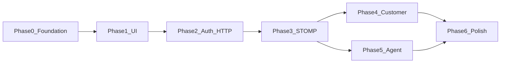

# Support chat — Angular 21 frontend plan

**Normative flow:** [context/ws-protocol.md](../../context/ws-protocol.md)  
**REST & STOMP reference:** [context/support_chat_api_endpoints.md](../../context/support_chat_api_endpoints.md) (and full spec if needed)

**Backend** implementation lives under `api/`; this plan covers `**web/`** only.

**Context copy (repo docs):** [context/support_chat_frontend_plan.md](../../context/support_chat_frontend_plan.md) — keep in sync when editing phases.

**Test layers:** **Vitest** = unit/integration (parsers, services). **Playwright** = browser E2E per phase (each phase adds or extends specs so you can **run tests and watch the browser**). A phase is not “done” until its Playwright spec passes (and you have used **headed** or **UI mode** at least once to confirm visually).

---

## Goals


| Requirement    | Approach                                                                                                                                                                                                  |
| -------------- | --------------------------------------------------------------------------------------------------------------------------------------------------------------------------------------------------------- |
| **UI feel**    | Bootstrap-like patterns (cards, navbar, buttons, form groups, list groups, tabs) implemented with **TailwindCSS 4** only — no Bootstrap CSS/JS dependency                                                 |
| **Structure**  | **Feature-driven** top-level areas under `app/`: **`core`** (platform), **`auth`** (identity), **`tchat`** (support chat product — CU + AU); facades live under `tchat/customer` and `tchat/agent`         |
| **Typing**     | **No `any`** — enable/keep strict mode, typed HTTP + STOMP payloads, `@typescript-eslint/no-explicit-any`                                                                                                 |
| **Angular 21** | **Signals** for UI state (`signal`, `computed`, `linkedSignal` where it reduces boilerplate); `input()` / `output()` for components; `inject()`; **control flow** `@if` / `@for` / `@switch` in templates |
| **Responsive** | Mobile-first Tailwind breakpoints (`sm` / `md` / `lg` / `xl`): stacked layouts → split panes on tablet/PC; touch-friendly targets on small screens                                                        |
| **Brand**      | Logo asset: `**web/public/brand/ycyw-logo.png`** (stacked mark + wordmark). Header: icon-only or compact variant on narrow widths; full logo on `md+`                                                     |


---

## Suggested directory layout (feature-driven)

Top-level under **`app/`**: **`core`** (platform), **`auth`** (login and guards), **`tchat`** (support chat — both customer and agent). No separate `features/` root; the chat domain stays in one module tree.

```text
web/src/app/
  core/
    config/           # apiBaseUrl, wsUrl from environment
    api/              # HttpClient, JWT interceptor, generic HTTP helpers
    websocket/        # ChatStompService — SockJS + STOMP, connect headers, resubscribe
    layout/           # shell: header (logo), nav, router-outlet
    ui/               # generic presentational pieces (btn, card, tabs, …) — Tailwind-only
    util/             # pure helpers (debounce, ids)
  auth/
    pages/            # login (and any auth-only screens)
    *.service.ts      # token, role, login/logout (split files as needed)
    *.guard.ts        # functional guards, role-based redirects
  tchat/
    models/           # REST + STOMP DTOs for chat (mirror backend; e.g. ws-events.ts)
    customer/         # CU routes, pages, components, customer chat facade/service
    agent/            # AU routes, pages, components, agent inbox facade/service
  app.routes.ts
  app.config.ts
```

**Rules:** `auth` and `tchat` import from `core` only — not from each other (avoid cycles). `tchat/customer` and `tchat/agent` share **`tchat/models`** and, if needed, a small **`tchat/ui`** for chat-specific widgets; keep **`core/ui`** generic.

---

## Product flows (from `ws-protocol.md`)

### Customer (CU)

1. Login → **`/support/chat`** (live) and **`/support/archived`** (archived list); use a `/support` parent route with child routes if you prefer one layout shell.
2. `**GET /api/chat/active`** — if 404, prompt first message → `**POST /api/chat/active**`; handle **409** by re-fetching active chat.
3. Open **STOMP** after `chatId` known: connect to `**/ws`** with JWT; subscribe `**/topic/chat/{chatId}**`; handle `**/user/queue/errors**` for command failures.
4. `**GET /api/chat/{chatId}/messages**` for history / infinite scroll.
5. **Archived:** `**GET /api/chat/archived`** (separate view or tab).
6. **Typing:** debounced `**/app/chat.typing`**; show remote **TYPING** events.
7. **Send / edit / delete** via STOMP; reconcile `**clientMessageId`** with **MESSAGE_*** events and error queue.

### Agent (AU)

1. Connect **STOMP early** after login — `**/user/queue/chats`** for **CHAT_LIST_UPDATED**.
2. `**GET /api/agent/chats?bucket=…`** for **NEW_REQUESTS** | **MY_ACTIVE** | **OTHERS_ACTIVE** | **ARCHIVED** (UI: **`/agent/archived`** for the archived list).
3. Open request → `**/app/chat.attach`**; then full thread + same topic/events as CU.
4. **Close** via `**/app/chat.close`**; reflect **CHAT_STATUS** `CLOSED` and bucket moves.

---

## Typed WebSocket contract

Mirror server payloads in **`tchat/models/ws-events.ts`** (names illustrative — align with backend JSON):

- Topic `**/topic/chat/{chatId}`:** discriminated union on `type`: `MESSAGE_CREATED` | `MESSAGE_UPDATED` | `MESSAGE_DELETED` | `CHAT_STATUS` | `USER_JOINED` | `USER_LEFT` | `TYPING`.
- `**/user/queue/chats`:** e.g. `{ type: 'CHAT_LIST_UPDATED' }`.
- `**/user/queue/errors`:** `{ type: 'ERROR'; code: string; message: string; clientMessageId?: string }` (match `ChatStompErrorPayload`).

Use **type guards** or `**switch (event.type)`** when handling frames — no untyped JSON.

**Dependencies (to add):** `sockjs-client`, `@stomp/stompjs` (+ DefinitelyTyped if needed). Wrap in `core/websocket` so features never touch raw `any` client types — export narrow interfaces.

---

## Tailwind: “Bootstrap-like” without Bootstrap

- In `**src/styles.css`**, use Tailwind v4 `@theme` to define **brand tokens** inspired by the logo: primary red, secondary blue, neutral text, radii (`rounded-lg` ~ Bootstrap card), shadow-sm for cards.
- Add `**@layer components`** utility classes only where repetition is high, e.g. `.btn`, `.btn-primary`, `.form-label`, `.form-control`, `.card`, `.card-header` — implemented as Tailwind `@apply` stacks (keeps HTML readable like Bootstrap).
- Prefer **semantic HTML** + focus rings (`focus-visible:ring-2`) for accessibility.

---

## Responsive behavior (concrete)


| Breakpoint           | Layout hints                                                                                         |
| -------------------- | ---------------------------------------------------------------------------------------------------- |
| **Default (mobile)** | Single column; chat list as full-screen sheet or drawer; header with small logo; bottom-safe padding |
| `**md` (tablet)**    | Optional two-column: list | thread (50/50 or 40/60)                                                  |
| `**lg` (PC)**        | Agent: left bucket sidebar + main thread; CU: optional archive drawer + main chat                    |


Use `**container` + `px-4`** and `**min-h-dvh**` for stable mobile height (address bar).

---

## Routing & guards (sketch)

| Path | Role | Purpose |
|------|------|---------|
| `/login` | guest | Login form |
| `/support/chat` | `CLIENT` | CU **live** support chat (resolve/create active chat, thread, STOMP) |
| `/support/archived` | `CLIENT` | CU **archived** chats list + open closed thread (`GET /api/chat/archived`, messages read-only per policy) |
| `/agent` | `AGENT` | AU inbox hub (redirect to default bucket or tabs for `NEW_REQUESTS` / `MY_ACTIVE` / `OTHERS_ACTIVE`) |
| `/agent/archived` | `AGENT` | AU **archived** system-wide list (`GET /api/agent/chats?bucket=ARCHIVED`) + optional thread view |
| `/agent/chat/:chatId` | `AGENT` | AU chat detail (attach, messages, close) — also reachable from bucket lists |

Child routes such as `/agent/bucket/:bucket` are optional if you fold buckets into query params or tabs on `/agent`; keep **`/support/archived`** and **`/agent/archived`** as stable entry points for archived UX.

**Functional guards** using `inject()` + `AuthService` signals (e.g. `isAuthenticated`, `role`).

---

## Playwright E2E harness (shared)

| Topic | Convention |
|-------|------------|
| **Location** | e.g. `web/e2e/` with `*.spec.ts` — **one primary spec file per phase** (`phase-0-shell.spec.ts`, `phase-1-ui-kit.spec.ts`, …) so each step stays testable in isolation. |
| **Tooling** | `@playwright/test`; `playwright.config.ts` with `baseURL` (e.g. `http://127.0.0.1:4200`), `testDir: 'e2e'`. |
| **App server** | Use `webServer` in config to run `ng serve` (or document “start `ng serve` + `api` manually” if you prefer). |
| **Manual visual check** | `npx playwright test --headed` opens a real browser; **`npx playwright test --ui`** is best for stepping through while you watch. Add npm scripts: `test:e2e`, `test:e2e:headed`, `test:e2e:ui`. |
| **Selectors** | Prefer **`data-testid`** on shell, login fields, chat list, message rows, and connection badges so Playwright stays stable (no brittle CSS). |
| **Backend** | From Phase 2 onward, E2E assumes **API is running** (local or CI). Use env vars in Playwright for `baseURL`, and optional `E2E_CU_USER` / `E2E_CU_PASSWORD` / `E2E_AGENT_*` (mirror [../../.env.example](../../.env.example)); never commit secrets. |
| **CI** | Later: run `npx playwright install --with-deps` then `npm run test:e2e` headless in pipeline. |

---

## Step-by-step development phases

Implement **in order**; each phase should be **shippable**: `npm run build`, Vitest where applicable, **and Playwright spec(s) for that phase green** before the next. The YAML `todos` at the top mirror these phases — mark them completed as you go.



**Parallelism:** Phase 5 can start once Phase 3 is done (STOMP + models), but **recommended** is finish Phase 4 first so thread/event handling is proven before duplicating for AU.

### Phase 0 — Foundation

| Item | Detail |
|------|--------|
| **Scaffold** | Create `core/`, `auth/`, `tchat/` per layout; empty `tchat/customer`, `tchat/agent`, `tchat/models` as needed. |
| **Config** | `core/config` — `apiBaseUrl` and `wsUrl` (e.g. `environment*.ts` or build-time replace; align with [../../.env.example](../../.env.example) / dev proxy if you add one). |
| **Strictness** | `tsconfig` strict; add ESLint + `@typescript-eslint/no-explicit-any` (and no unused vars). |
| **Tailwind** | Brand `@theme` tokens; global `styles.css`; optional `@layer components` (`.btn`, `.card`). |
| **Shell** | `core/layout` — header with **`/brand/ycyw-logo.png`**, nav placeholders, `<router-outlet>`, default redirect. |
| **Playwright** | **Phase 0 spec:** e.g. `e2e/phase-0-shell.spec.ts` — `page.goto('/')` (or `/login`), **`expect` logo** `[data-testid="app-logo"]`, header/shell visible, no console error threshold you define. Run `--headed` once to confirm layout. |
| **Verify** | `npm run build`; **Playwright phase-0** passes; no `any` in new code. |

### Phase 1 — Design system (`core/ui`)

| Item | Detail |
|------|--------|
| **Primitives** | Buttons (primary/secondary/outline), inputs, card, alert, tabs, modal or drawer — all `input()`/`output()` signals where stateful. |
| **Responsive** | Touch targets `min-h`/`min-w` on mobile; stack vs row at `md`. |
| **Playwright** | **Phase 1 spec:** e.g. `e2e/phase-1-ui-kit.spec.ts` — visit `/dev/ui` (or agreed route); **`expect` visible** primary button, input, card with `data-testid`s; optional `page.setViewportSize` for mobile width and re-assert layout. |
| **Verify** | `npm run build`; **Playwright phase-1** passes. |

### Phase 2 — HTTP + auth (`core/api`, `auth`)

| Item | Detail |
|------|--------|
| **HTTP** | `provideHttpClient(withInterceptors(...))`; JWT `Authorization` from `AuthService` signal/token. |
| **Auth API** | Login against backend (e.g. `POST /auth/login`); store token + decode role from response/JWT as backend provides. |
| **Signals** | `AuthService`: `isAuthenticated`, `role`, `login`, `logout`; persist token (memory + `sessionStorage` or `localStorage` per security choice). |
| **Guards** | `authGuard`, `clientGuard`, `agentGuard`; post-login redirect: **CLIENT** → `/support/chat`, **AGENT** → `/agent`. |
| **Routes** | Wire `/login`; protect `/support/*` and `/agent/*`. Stub pages (“Coming soon”) OK. |
| **Playwright** | **Phase 2 spec:** e.g. `e2e/phase-2-auth.spec.ts` — with **API up**, fill `[data-testid="login-username"]` / password, submit, **`expect` URL** `/support/chat` or `/agent` per test user; visit peer route **`expect` redirect or 403 UX**; optional reload and assert still logged in if using storage. |
| **Verify** | Login works against running `api`; **Playwright phase-2** passes; wrong role cannot open peer routes. |

### Phase 3 — STOMP core (`core/websocket`, `tchat/models`)

| Item | Detail |
|------|--------|
| **Deps** | `sockjs-client`, `@stomp/stompjs`; wrap types so **no `any`** leaks from STOMP client. |
| **Models** | `tchat/models` — REST DTOs + `ws-events.ts` discriminated unions + `parseChatTopicPayload(json: string): ChatTopicEvent \| null` (narrowing). |
| **Service** | `ChatStompService` (or name in `core/websocket`): connect to `wsUrl` + SockJS, STOMP `Authorization: Bearer`, disconnect, `subscribe(destination, handler)`, `publishJson(destination, body)`, reconnect strategy + resubscribe hooks. |
| **Debug UX** | Short-lived **dev-only** route or banner: `[data-testid="stomp-status"]` = `connected` \| `disconnected` \| `error` so Playwright can assert transport without parsing WS frames. |
| **Playwright** | **Phase 3 spec:** e.g. `e2e/phase-3-stomp.spec.ts` — login as CU or AGENT, open page that triggers STOMP connect, **`expect(stomp-status)`** becomes `connected` within timeout; optional disconnect network (Playwright offline) and assert status degrades if you implement that UX. |
| **Verify** | Vitest for parsers; **Playwright phase-3** passes (proves JWT handshake + SockJS in real browser). |

### Phase 4 — Customer (`tchat/customer`)

| Item | Detail |
|------|--------|
| **4a Routes** | `/support/chat`, `/support/archived` with shared layout if desired. |
| **4b REST** | Service: `GET/POST /api/chat/active`, `GET /api/chat/archived`, `GET /api/chat/{id}/messages` — all typed. |
| **4c Live chat** | On `/support/chat`: resolve active chat; 404 → prompt + `POST` initial message; 409 → retry GET; render message list (REST first). |
| **4d Realtime** | After `chatId`: subscribe `/topic/chat/{chatId}` + `/user/queue/errors`; `send` via `/app/chat.send` with `clientMessageId`; merge **MESSAGE_*** events into UI state (signals). |
| **4e Typing** | Debounced `/app/chat.typing`; show **TYPING** from others. |
| **4f Archived** | `/support/archived`: list + navigate to thread; load messages (read-only UX per policy). |
| **4g Edit/delete** | If in scope: `/app/chat.edit`, `/app/chat.delete` + optimistic updates / event reconciliation. |
| **Playwright** | **Phase 4 spec(s):** e.g. `e2e/phase-4-customer.spec.ts` — create or open active chat, **`expect` message list** / `[data-testid="chat-message"]`; send line, **expect new row** (or `data-testid` on optimistic bubble); open **`/support/archived`**, **`expect` list or empty state**; add second spec or `test.describe` for typing indicator if two browsers needed (use second `browser.newContext` + login as agent in parallel) or defer two-user typing to Phase 6. |
| **Verify** | Full CU happy path vs `api`; **Playwright phase-4** passes; use **`--headed`** to confirm realtime feel. |

### Phase 5 — Agent (`tchat/agent`)

| Item | Detail |
|------|--------|
| **5a Routes** | `/agent` (inbox), `/agent/archived`, `/agent/chat/:chatId`. |
| **5b STOMP inbox** | On agent login: connect STOMP; subscribe **`/user/queue/chats`**; on **CHAT_LIST_UPDATED** refresh lists or patch state. |
| **5c REST buckets** | `GET /api/agent/chats?bucket=NEW_REQUESTS|MY_ACTIVE|OTHERS_ACTIVE|ARCHIVED` with tabs or sub-routes. |
| **5d Detail** | From **NEW_REQUESTS** open `/agent/chat/:id`; **attach** `/app/chat.attach`; then same topic subscription + send/typing/close as CU. |
| **5e Close / archive** | `/app/chat.close`; UI reflects **CHAT_STATUS** `CLOSED`; lists refresh. |
| **Playwright** | **Phase 5 spec:** e.g. `e2e/phase-5-agent.spec.ts` — login as agent, **`expect` bucket tabs** or default inbox; open new request, **attach**, **`expect` thread**; send message; navigate **`/agent/archived`**, assert row or empty state; optional **two-context** flow: CU creates chat in one context, agent sees list update (flaky unless waits tuned — use `expect.poll` / stable `data-testid`). |
| **Verify** | AU happy path + guards; **Playwright phase-5** passes. |

### Phase 6 — Polish & QA

| Item | Detail |
|------|--------|
| **Responsive** | Final pass mobile / tablet / desktop; agent two-pane at `lg`. |
| **A11y** | Focus order, labels, live region for new messages if appropriate. |
| **Tests** | Vitest for parsers, `AuthService`, STOMP facade; component tests for login + message list (mock STOMP). |
| **Playwright** | **Phase 6 — regression:** expand specs with **projects** or loops for **viewport presets** (mobile / tablet / desktop); run full **smoke** from [context/ws-protocol.md](../../context/ws-protocol.md) (CU + AU); add **`test:e2e:headed`** to package scripts if not already. Prefer **`--ui`** for exploratory passes. |
| **Verify** | `npm run build` + `npm test` + **`npm run test:e2e`** (full suite headless); documented checklist satisfied. |

---

## Testing

- **Vitest** (already in `web/package.json`) for services and reducers-like logic (STOMP handler parsing with fake frames).
- **Playwright** for **browser E2E** — one spec group per phase (see **Playwright E2E harness** and phase tables). Component tests optional — mock STOMP via `ChatStompService` test double where unit-testing components.

---

## Implementation checkpoints (summary)

After **every** phase: `npm run build`; Vitest where relevant; **Playwright spec(s) for that phase**; use **`npx playwright test --headed`** or **`--ui`** at least once before merging the phase so you **see** the browser. Details are in **Step-by-step development phases** and **Playwright E2E harness** above.

**Plan locations:** [`.cursor/plans/support_chat_frontend.plan.md`](support_chat_frontend.plan.md) (this file) and [context/support_chat_frontend_plan.md](../../context/support_chat_frontend_plan.md).