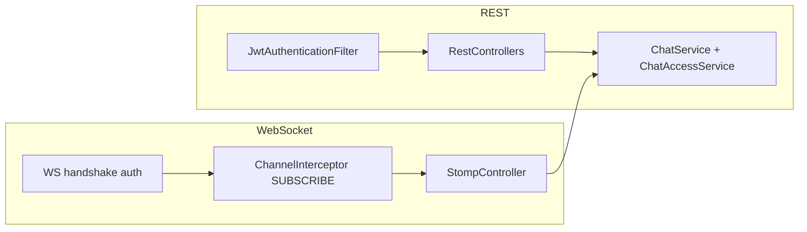

# Support chat — step-by-step implementation plan

**Goal:** Implement REST + STOMP WebSocket for support chat with **role** (CLIENT vs AGENT) and **participant/owner** checks, organized under [`api/src/main/java/com/ycyw/api/tchat/`](api/src/main/java/com/ycyw/api/tchat/).

**Spec references:** [context/support_chat_web_socket_api_spec_clean.md](context/support_chat_web_socket_api_spec_clean.md), [context/support_chat_api_endpoints.md](context/support_chat_api_endpoints.md).

**Deliverable document:** This file — **[`.cursor/plans/support_chat_implementation.plan.md`](.cursor/plans/support_chat_implementation.plan.md)** — is the project-local checklist (version with git if `.cursor/` is tracked).

---

## Current codebase facts (constraints)

- [`User`](api/src/main/java/com/ycyw/api/user/model/User.java) has `Role.CLIENT` / `Role.AGENT` but **`getAuthorities()` returns an empty list** — `@PreAuthorize("hasRole('CLIENT')")` will **not** work until authorities emit `ROLE_CLIENT` / `ROLE_AGENT` (e.g. `SimpleGrantedAuthority("ROLE_" + role.name())`).
- [`SecurityConfig`](api/src/main/java/com/ycyw/api/config/SecurityConfig.java) uses `@EnableMethodSecurity` and JWT filter on the main API chain; WebSocket handshake for `/ws` must be **explicitly** secured and wired to JWT (see Phase 4).
- [`Chat`](api/src/main/java/com/ycyw/api/tchat/model/Chat.java) already maps `client`, `agent`, `status` — good fit for participant checks.

---

## Recommended package layout (`tchat`)

| Package | Contents |
|---------|----------|
| `tchat.model` | Existing entities; add DTOs only if you prefer co-location, else `tchat.dto` |
| `tchat.repository` | `ChatRepository`, `ChatMessageRepository` (Spring Data) |
| `tchat.service` | `ChatService`, `ChatMessageService`, **`ChatAccessService`** (participant + role rules) |
| `tchat.web.rest` | `ChatRestController` (`/api/chat/**`), `AgentChatRestController` (`/api/agent/chats`) |
| `tchat.web.ws` | `ChatStompController` (`@MessageMapping` for `/app/chat.*`), optional `StompExceptionHandler` |
| `tchat.config` | `WebSocketSecurityConfig`, `WebSocketConfig` (broker, app prefix, user destination prefix) |

**Rule:** Controllers are **thin**; **all** `chatId` operations call **`ChatAccessService`** (or services that delegate to it) so REST and WS stay consistent.

---

## Phase 0 — Security foundation (small, mandatory review)

**What:** Fix `User.getAuthorities()` to return `ROLE_CLIENT` / `ROLE_AGENT`.

**Why:** Enables `@PreAuthorize` on REST and (once STOMP security context is set) on `@MessageMapping`.

**Review checkpoint:** Open `User.java`, confirm one authority per user matches JWT-loaded principal used in [`JwtAuthenticationFilter`](api/src/main/java/com/ycyw/api/security/jwt/JwtAuthenticationFilter.java).

---

## Phase 1 — Database and repositories

**What:**

- Ensure tables for `chats` and `chat_messages` match entities ([`ChatMessage`](api/src/main/java/com/ycyw/api/tchat/model/ChatMessage.java) if present). Prefer **Flyway** migration in [`api/src/main/resources/db/migration/`](api/src/main/resources/db/migration/) (project has Flyway enabled) instead of relying only on `ddl-auto` for production-shaped work.
- Add `ChatRepository` with queries for:
  - CU: one non-closed chat by `client_id`; archived list by `client_id` + `CLOSED`.
  - AU: four **bucket** queries (or one dynamic query) matching spec: `NEW_REQUESTS`, `MY_ACTIVE`, `OTHERS_ACTIVE`, `ARCHIVED`.
- Add `ChatMessageRepository` with pagination by `chatId`, `createdAt`, and optional cursor (`before`/`after` message id).

**Review checkpoint:** Review SQL / JPQL only — indexes on `(chat_id, created_at)` for messages; understand each bucket predicate in plain language.

---

## Phase 2 — `ChatAccessService` (participant + role)

**What:** Single place for:

- `assertParticipant(chatId, userId)` — load chat, allow if user is **client** or **agent** on that chat.
- `assertClient(chatId, userId)` for CU-only endpoints (`POST /active`, `GET /archived`).
- `assertAgent(...)` for agent-only listing; bucket logic may live in `ChatQueryService` but **authorization** (e.g. only agents call `/api/agent/chats`) stays on controller via `@PreAuthorize` + service checks where needed.

**Review checkpoint:** Walk through matrix: CLIENT accessing another client’s chat → **deny**; AGENT accessing unassigned chat for **read** (messages) only if product allows — align with spec (“only participants”); typically **attach** before agent is participant — **decide explicitly:** either allow agents to read **NEW_REQUESTS** only via list + attach flow, or allow message read after attach only. Document the chosen rule in code comments (one short paragraph).

---

## Phase 3 — REST API (incremental)

Implement in **small PR-sized chunks**, each reviewable alone:

1. **DTOs + mappers** — request/response types for active chat, archived list, agent list, message page.
2. **`POST /api/chat/active`** — `@PreAuthorize` CLIENT; enforce “one active chat per CU” in service.
3. **`GET /api/chat/archived`** — CLIENT; scoped to current user’s closed chats.
4. **`GET /api/agent/chats`** — AGENT; required `bucket` query param; pagination.
5. **`GET /api/chat/{chatId}/messages`** — participant; `limit` / `before` / `after`; ACTIVE or CLOSED.

**Review checkpoint:** For each endpoint: Swagger annotation, controller **only** delegates, service contains business rules, `ChatAccessService` used for `{chatId}` paths.

---

## Phase 4 — WebSocket infrastructure

**What:**

- Register STOMP endpoint `/ws` (SockJS optional per frontend).
- Configure `ApplicationDestinationPrefixes` `/app`, `UserDestinationPrefix` `/user`, broker prefix `/topic`.
- **Handshake security:** Allow handshake URL (e.g. `/ws/**`) on a filter chain that accepts JWT (header or **query parameter** for browser WebSocket if needed) and establishes `SecurityContext` before STOMP CONNECT.
- **Inbound `ChannelInterceptor`:** On **CONNECT**, ensure principal is set; on **SUBSCRIBE** to `/topic/chat/{chatId}`, parse `chatId` and call `ChatAccessService` — reject subscription if not participant.

**Review checkpoint:** Trace one SUBSCRIBE with a wrong `chatId` → must fail before any event is received.

---

## Phase 5 — STOMP command handlers

**What:** `@MessageMapping` methods for `/app/chat.send`, `.edit`, `.delete`, `.attach`, `.detach`, `.close`, `.typing` — each payload DTO, delegate to same services as REST where overlap exists (send/edit/delete/close).

**Review checkpoint:** Each handler: principal from `SecurityContext`, `chatId` validated, same permission rules as REST.

---

## Phase 6 — Broadcasting

**What:** Use `SimpMessagingTemplate` to send to `/topic/chat/{chatId}` and `/user/queue/chats`, `/user/queue/errors` per spec event types (`MESSAGE_CREATED`, etc.).

**Review checkpoint:** One integration-style test or manual script: two users, subscribe, send message, both receive canonical event.

---

## Phase 7 — Tests and hardening

**What:**

- Unit tests: `ChatAccessService`, bucket repository queries.
- `@WebMvcTest` for REST controllers with mocked security.
- Optional: `@SpringBootTest` WebSocket test ( heavier).

**Review checkpoint:** List of scenarios: forbidden cross-tenant chat, agent bucket isolation, closed chat message read.

---

## Phase 8 (optional) — Angular (`/web`)

Wire `npm` STOMP client, JWT on connect, subscribe to topics — only after backend phases 3–6 are stable.

---

## How to “control every chunk”

After each phase:

1. Stop and **read the diff** for that phase only.
2. Run **`./gradlew test`** (and targeted new tests).
3. Use Swagger for REST; use a STOMP client for WS before integrating the SPA.

---

## Risk list

| Risk | Mitigation |
|------|------------|
| Empty authorities break `@PreAuthorize` | Phase 0 |
| WS bypasses HTTP filters | Dedicated handshake + STOMP interceptors (Phase 4–5) |
| Agent reads messages before attach | Explicit rule in Phase 2 + tests |
